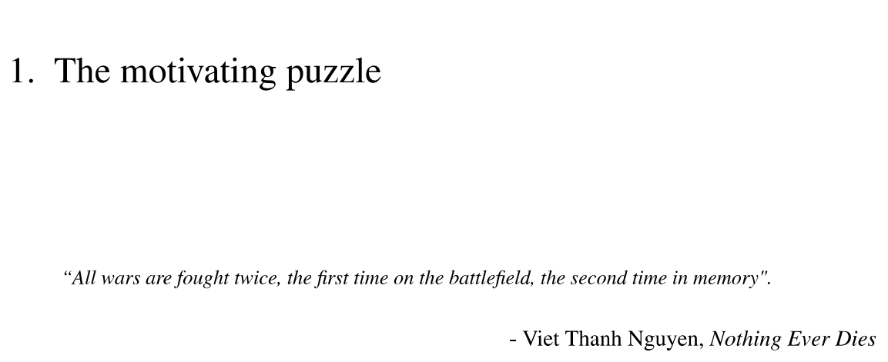

# DPCR_MA_Thesis_Template
A LaTeX template for the Master's thesis at the Department of Peace and Conflict Research, Uppsala University. 

Summary
=======

We all want a nice-looking thesis. When everyone is roasting your ideas
at the defense, at least you can still have the look going for you. Of
course, there are many ways to earn this boasting right. Perhaps you're
already a wizard in Microsoft Word. Or perhaps you're thinking about
LaTeX, which is a widely used typesetting tool in the academic realm.
Although I enjoyed learning this markup language, I also found that I
spent a lot of time debugging or just figuring out how certain things
work. Assuming that you are unfamiliar with LaTeX, this document will
briefly introduce what it is and why you should (or shouldn't) consider
it for your thesis. I'm not an expert in LaTeX, but I will point you to
some useful resources to help you get started. This includes a modified
version of the UU thesis template, which should help you produce the
department's formatting requirement without much tinkering.
If you are already familiar with LaTex, just go ahead and download the `Thesis Overall.tex`, `UUThesisTemplate.cls`, and `References.bib` to the same folder. 

The pros and cons of LaTeX
==========================

By this point I hope you haven't made the mistake of looking up LaTeXin
public. Funny name aside, it is a document preparation system, much like
your usual Microsoft Word. Unlike in Word, where "what you see is what
you get", however, you will be producing mostly plain text; the
formatting, such as paper size, fonts, and spacing, is defined in a
separate section, usually called the "preamble".

Let's be real, LaTeXis not for every purpose. My friends who study maths
and physics will swear by LaTeX, but in our field, rarely will you ever
need to write mathematical equations unless you're working with formal
modelling. Other people also praise this tool because it allows you to
focus on creating your content, instead of obsessively wrestling with
Word's idiosyncracies. I made the choice of writing my thesis in this
format after the half-way seminar because I was kind of stubborn, and
because I knew it was a widely used tool in academia. I certainly
enjoyed the end product--my thesis came together seamlessly without
having to worry if I'd missed an indent for a random paragraph--as well
as the process of *making things work*. However, if you are new to this
typesetting tool, there are certainly some drawbacks. Here, I'll break
down what I found to be its pros and cons as a beginner user, and you
can decide for yourself.

Pros:

-   It can turn out neat and elegant.

-   It is especially convenient if you plan to conduct statistical
    analysis in R. The package stargazer, for instance,
    can produce your tables in LaTeXformat, which renders beautifully.

-   Building the table of content and the list of figures is a breeze.
    They automatically update every time you compile your files.

-   Referencing, once you've set up everything, is also a breeze. It is
    also convenient to switch citation style if you want to revise your
    thesis to submit it elsewhere.

-   It's a useful skill to know if you plan to pursue a career in
    academia. It is also useful for creating a CV or resume, as there
    are already hundreds of templates online.

-   In this case, you don't have to start from scratch. Uppsala
    University has built a template for PhD dissertations, which I have
    modified to suit the formatting requirements for MA theses at the
    department.

Cons, or common complaints about LaTeX:

-   Tables are a pain.

-   Diagrams? Thankfully you'll only need one, but, again, this may be
    time-consuming. See [3.3.3](#sssec:num1).

-   No straight-forward method for word count.

-   It's terrible for collaboration. Your supervisor and classmates will
    have to edit your drafts as PDF files, and we all know how annoying
    that can be.

-   UU doesn't provide any technical support for LaTeX, and not all your
    classmates will be on the same boat. In other words, you will be
    swimming on your own.

-   Many people will tell you that LaTeXis better for productivity, but
    this may not be true. There has been many Internet wars, even [an
    experiment](https://journals.plos.org/plosone/article?id=10.1371/journal.pone.0115069),
    on the topic with no clear consensus reached. Overall, LaTeXmay have
    a steeper learning curve and, therefore, require more time and
    effort.

At the end of the day, it all boils down to your personal preference and
how much time you have on hand. Most things you can do with LaTeXcan be
achieved with Microsoft Word. For example, building a table of content
in Word is just as easy using the built-in Outline mode. On the other
hand, most of the cons can be addressed, which I have done in the
sections to follow. In short, if the deadline is looming on the horizon,
stick with whatever tool that you already know best. For the rest of the
document, let's pretend that you are somewhat interested in learning
this skill.

Getting started
===============

The setup
---------

To begin, you need a TeXeditor and compiler. There are many options on
the market--many of which are free, and often the choice depends largely
on your operating system. At the very minimum, you can write your
document in Notepad and compile it in a command terminal. However, I'd
recommend going for a LaTeX-specific editor. As a Windows user, I have
only tried the classic combination of TeXworks/MiKTeX and very much
liked the simplicity. TeXstudio is also a popular free editor, and it
provides shortcuts for common LaTeXsyntaxes, e.g. how to write letters
with accent, attach graphics, and even convert outputs into Word
documents. Other paid options include extra tools that make your life
easier. The free version of Overleaf, for example, is online and allows
you to preview your PDF as you go. The paid version also supports
collaboration between authors. Here is a list of TeX clients so you can
shop around and find out which one you like best.\
TeXworks/MiKTeX: <http://www.tug.org/texworks/>\
TeXstudio: <https://www.texstudio.org/>\
Overleaf: <https://www.overleaf.com/>

Organizing your files
---------------------

The first thing you should start with is organizing your thesis draft
folder. During the compilation process, LaTeXwill produce many temporary
files. If you're putting your main thesis file in a big folder, for
instance, it will make that folder look like trash.

Let's start in your main working directory. This is where your main .tex
file and the template file should do. Then, following the advice of Mori
[-@mori2007writing], I created three folders: `\bib` for the
bibliography file, `\fig` for figures, and `\tex` for all the chapters.
This means that you write each chapter separately, which will then be
called on in your main `.tex` file and compiled. There is no preamble in
the chapter file, as all formatting choices are configured in the main
`.tex` file, as well as in the `.cls` template.

Co-opting the UU Thesis Template
--------------------------------

Uppsala University has constructed its own LaTeXtemplate for PhD
dissertations, which can be downloaded
[here](https://libguides.ub.uu.se/Thesis/Template_LaTeX). Unfortunately,
their website says that there is no longer any official support for
LaTeX. Furthermore, the template requires some tweaking, because it is
originally designed with a *printed* dissertation in mind. This means
that you will find blank pages which are there so that a chapter could
begin on a right-sided page of a book, but which you don't really need
in your Master's thesis. But, the template can still be useful,
especially if you are just starting out with LaTeXand do not want to
spend too much time figuring out the smaller details, such as font sizes
for each heading level or page margins.

In this folder, you will find two documents titled `Overall.tex` and
`UU_Thesis_Template.cls`. `Overall.tex` will be your main working
document, on which you will run the compilation process to obtain the
final `.pdf` product. In the preamble section of this file, I have added
all the useful packages that you may need. I have also adjusted the
`UU_Thesis_Template.cls` file so that it will help you meet the
formatting requirements for the MA thesis at the department.

### Cover page

To add information to the cover page, search for the phrase "cover page"
in the template file.

### Tables

For descriptive and result tables, the packages `stargazer` and `texreg`
in R can both produce LaTeXoutputs, which you can
effortlessly copy and paste into your document. The problem begins when
you have tables that are longer than one page, or tables containing
paragraphs. In these cases, consider the merits of the packages
`tabular*`, `tabularx`, `tabulary`, and `longtable`.

### Attaching graphics and diagrams

For diagrams, `tikz` is common choice, but it is by no means the best
choice. If you like coordinate geometry, perfect. If not, just create
your diagram with your favorite graphic tool (Kristine recommended
<https://www.draw.io/>), and insert it as a graphic using the package
`graphicx`.

### Bibliography

As mentioned above, creating a bibliography in LaTeXis a breeze. I
recommend using `biblatex` and any reference management software of your
choice (I use the free Zotero). In the preamble of the `Overall.tex`
file, you will find that the document is set to produce the Chicago
author-date citation format. All you need to do is to produce a `.bib`
file from your reference manager, put it in the appropriate folder, and
call on it in the `\addbibresource{}` tag. After that, run the
compilation process in the following order:
`pdflatex -> Biber -> pdflatex x2`.

Here is a cheat sheet for `biblatex`:\
[`http://tug.ctan.org/info/biblatex-cheatsheet/biblatex-cheatsheet.pdf`](http://tug.ctan.org/info/biblatex-cheatsheet/biblatex-cheatsheet.pdf)

### Word count

There is no straightforward tool to calculate word count for LaTeX. The
most popular and accessible option is TeXcount:
<https://app.uio.no/ifi/texcount/index.html>. Or, convert your document
to Word format (see section [3.3.7](#sssec:num2)).

### Quotes at the start of your chapter

There are several approaches to this. Here is one example from my own
thesis. If you define the following command in your preamble,

```
\newcommand{\chapquote}[3]{\begin{quotation} \textit{#1} \end{quotation} \begin{flushright} - #2, \textit{#3}\end{flushright} }
```

and add this at the beginning of your chapter,
```
    \chapter{Introduction}
    \chapquote{``All wars are fought twice, the first time on the battlefield, the second time in memory".}{Viet Thanh Nguyen}{Nothing Ever Dies}
```
you will get something similar to this.



You may also find other suggestions on Stack Exchange. As this example
shows, defining a new command in the preamble is one way to add
customized formatting to your documents. The UU Thesis Template is
chockfull of its own commands, for instance. So if you are feeling
adventurous, and you have not found an acceptable solution on Stack
Exchange for what you have in mind, this is how you could go about
owning this LaTeX beast.

### Converting between formats

A common complaint about LaTeX is that it does not faciliate
collaboration among authors. Your end-product is almost always a `.pdf`
file, which makes it difficult to comment on or highlight typographies.
But, this is no longer a problem with Pandoc -- a document converter
that works with almost all markup formats. See their homepage for
details and instructions for download: <https://pandoc.org/index.html>.

For a concise guideline on how to convert a `.tex` file into `.docx`,
see this link:
[`https://medium.com/@zhelinchen91/how-to-convert-from-latex-to-ms-word-with-pandoc-f2045a762293`](https://medium.com/@zhelinchen91/how-to-convert-from-latex-to-ms-word-with-pandoc-f2045a762293).

As an example, I have carried out the same process on this document and
attached the `.docx` output in this folder.

Final thoughts
==============

Writing with LaTeXmay be annoying at the start, but things will get
smoother once you have everything set up, and the end result can be
rewarding. I hope that this document has been useful in giving you an
overall picture of this markup tool. If you spot any bug with the
template, or have any suggestion to make it better, please let me know.

Here are some additional resources:

-   Stack Exchange: <https://tex.stackexchange.com/>

-   An introductory guideline to writing your thesis in LaTeXby
    @mori2007writing.

Best of luck with your thesis!
